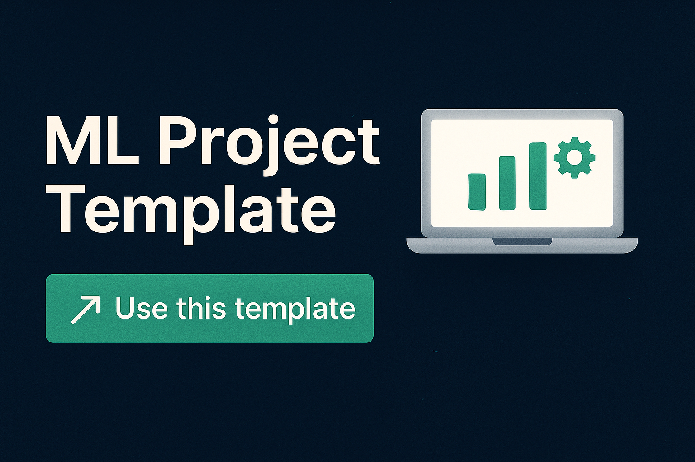

# ML Project Template

A reusable template to bootstrap local machine learning projects using Conda, PyTorch, TensorFlow, and JupyterLab. Supports GPU acceleration when available.

> 🧰 **To start a new project from this template**, click the green **“Use this template”** button on GitHub.

---

## 🚀 Getting Started

### 1. Clone the Repository

```bash
git clone https://github.com/yourname/ml-project-template.git
cd ml-project-template
```

### 2. Create a New Project

```bash
./setup/setup_ml_env.sh <project_name>
```

This will:

- Create a new folder: `./<project_name>`

- Set up a Conda environment named `<project_name>`

- Install Python 3.10, PyTorch (with CUDA), TensorFlow, and common ML libraries

- Copy a GPU validation script into the project

- Register a Jupyter kernel

- Launch VS Code in the project folder (if installed)


## 🧹 Cleaning Up a Project

To destroy an existing project and its environment:

```bash
./setup/destroy_ml_env.sh <project_name>
```

This will:

- Remove the Conda environment

- Unregister the Jupyter kernel

- Delete the project directory


## 📁 Directory Structure

```bash
ml-project-template/
├── setup/                      # Bootstrap and teardown scripts
│   ├── setup_ml_env.sh
│   └── destroy_ml_env.sh
├── validation/                 # Validation and diagnostic tools
│   └── gpu_check.py
├── .gitignore
├── README.md
```

## 📦 Installed Packages

- Python 3.10

- PyTorch + CUDA (12.1)

- TensorFlow

- NumPy

- pandas

- scikit-learn

- matplotlib

- JupyterLab


Modify `setup_ml_env.sh` if you want to install more packages.